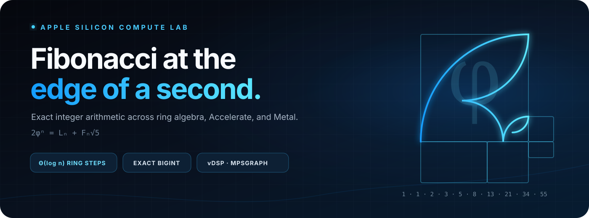
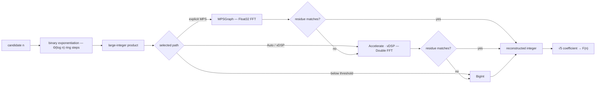
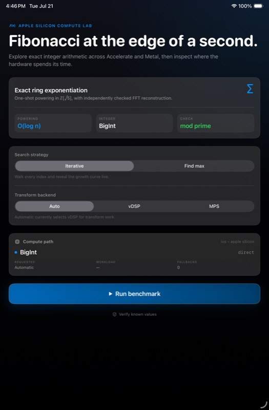

<p align="center">
  
</p>

<p align="center">
  <strong>A native iOS and macOS research app for exact Fibonacci computation.</strong><br>
  Logarithmic ring exponentiation, hardware-aware large-integer multiplication, and a live computation profile—built to make the mathematics inspectable.
</p>

<p align="center">
  <a href="https://luxiumservices.com/projects/fibonacci"><strong>Project context</strong></a>
  &nbsp;·&nbsp;
  <a href="https://luxiumservices.com/blog/fibonacci-computation-swift"><strong>Technical field note</strong></a>
</p>

<p align="center">
  <code>SwiftUI</code> · <code>BigInt</code> · <code>Accelerate / vDSP</code> · <code>MPSGraph</code> · <code>Swift Charts</code>
</p>

> [!NOTE]
> The one-second boundary is an observation from the current run on the current device. This is a research instrument—not a universal score, a cross-device leaderboard, or a published hardware benchmark.

---

## The experiment

**How large an exact Fibonacci value can this device compute in one second?**

Every candidate `F(n)` is computed independently. There is no recurrence cache and no reuse from `F(n - 1)`: each measurement starts from the same ring elements, performs its own binary exponentiation, and records the observed compute time.

| Mode | Search behavior | Best for |
|---|---|---|
| **Iterative** | Walks from `F(1)` upward until one computation reaches 1,000 ms | Revealing a continuous sampled growth profile |
| **Find Max** | Exponential probes, binary search, then bounded refinement | Approaching the observed boundary with fewer candidates |

Timing noise means the boundary can move between runs. Iterative mode retains the last value below the limit; Find Max brackets and refines a run-local candidate rather than claiming a device-independent maximum.

## The algebra

The implementation starts from one compact identity:

$$
2\varphi^n = L_n + F_n\sqrt{5}
$$

It stores scaled integer pairs `(a, b)` for values of the form $a + b\sqrt{5}$. The initial pair `(1, 1)` is $1 + \sqrt{5} = 2\varphi$; multiplication and squaring stay inside the quadratic ring, and an exact right shift removes the scale factor after each operation. The $\sqrt{5}$ coefficient is `F(n)`.

```text
(a + b√5)(c + d√5) = (ac + 5bd) + (ad + bc)√5
(a + b√5)²          = (a² + 5b²) + 2ab√5
```

Binary exponentiation reduces the control path to $\Theta(\log n)$ ring steps. The specialized square uses three large-integer products, while the general multiply recovers the cross term from `(a + b)(c + d) - ac - bd`.

## From index to exact integer



The current **Auto** policy routes transform-eligible work through vDSP. MPSGraph remains an explicitly selectable experiment on supported physical hardware; simulator execution transparently uses the CPU path. That routing is current source behavior, not a claim that one backend wins on every Apple device.

## Compute paths and integrity

| Path | Selection | Representation | Acceptance and fallback |
|---|---|---|---|
| **BigInt** | Multiply below 3,000 combined bits; square below 1,500 operand bits | Direct integer arithmetic | Used directly |
| **Accelerate / vDSP** | Transform-eligible CPU path and current Auto policy | Double FFT with base-$2^{15}$ digits | Carry reconstruction, residue check modulo `4,294,967,291`, then `BigInt` fallback on failure |
| **MPSGraph** | Explicit experimental selection on supported physical hardware | Float32 FFT with adaptive 1–3-bit digits | The same residue check, then vDSP and `BigInt` fallbacks |

The modular residue is an integrity check—not a formal proof of equality. It prevents unchecked floating-point reconstruction from being treated as an integer result, while the fallback ladder preserves a direct exact path when a transform cannot be accepted.

## A native computation instrument

<p align="center">
  
</p>
<p align="center"><sub>The idle research dashboard on iPad. Measurements and charts appear live during a run.</sub></p>

The interface exposes the computation instead of hiding it behind a single answer:

- **Strategy and backend controls** for Iterative, Find Max, Auto, vDSP, and MPSGraph.
- **Live telemetry** for index, elapsed compute time, active backend, FFT size, operand workload, device availability, and fallback count.
- **Logarithmic Swift Charts profile** with a visible one-second rule, bounded display sampling, and drag inspection.
- **Responsive native layouts** for compact iPhone, iPad, and macOS presentations, with Dynamic Type, reduced-motion behavior, semantic materials, and dark-mode contrast.

The arithmetic runs in a detached user-initiated task. `OSAllocatedUnfairLock` protects progress, sampled history, transform state, and plan caches; the main actor polls progress at 60 Hz while chart data and backend telemetry refresh at 10 Hz so rendering does not sit on the arithmetic critical path.

## Complexity, without the hand-wave

| Layer | Asymptotic shape | What it describes |
|---|---:|---|
| Ring powering | $\Theta(\log n)$ operations | Multiply/square control flow for one `F(n)` |
| Output size | $\Theta(n)$ digits | Fibonacci digit count grows linearly with the index |
| FFT product | $O(d\log d)$ | Multiplication for operands with `d` transform digits |
| Conservative composition | $O(n\log^2 n)$ | One result under the FFT multiplication model |

These are algorithmic claims, not elapsed-time predictions. Real crossover points depend on operand size, radix, transform setup reuse, memory behavior, thermal state, build configuration, and the selected device.

## Measured on an M3 Max

This example run was captured on **2026-07-22 at 03:25 UTC** from an Apple M3 Max with 48 GiB of memory, running macOS 27.0 (`26A5378n`). The executable was built in Release for arm64 and used the current Automatic policy, which routes transform-eligible work through vDSP.

**Headline result:** the same process produced the exact **44,920,000th Fibonacci number**—an integer with **9,387,725 decimal digits**—in a **997.481 ms median**. That is an output-size-normalized rate of **9.41 million decimal digits per second**, without recurrence caching or reuse from a neighboring Fibonacci value.

| Index | Decimal digits | Median | Minimum | Maximum |
|---:|---:|---:|---:|---:|
| `F(11,230,000)` | 2,346,931 | 236.880 ms | 228.310 ms | 239.155 ms |
| `F(22,460,000)` | 4,693,863 | 474.172 ms | 468.115 ms | 489.378 ms |
| `F(33,690,000)` | 7,040,794 | 801.495 ms | 794.403 ms | 830.187 ms |
| **`F(44,920,000)`** | **9,387,725** | **997.481 ms** | 980.579 ms | 1,027.579 ms |

The next refinement candidate, `F(44,926,553)`, crossed the boundary with a **1,005.986 ms** median. Each reported row is the median of seven steady-state computations after warm-up. Search candidates used three samples; decimal digit counts were computed outside the timed interval with the high-precision Binet digit-count identity.

> [!IMPORTANT]
> The boundary is median-defined, not a claim that every trial finishes below one second. The accepted candidate ranged from 980.579 ms to 1,027.579 ms across seven samples; the complete distribution is preserved in the raw report.

### What happens inside that second

For `F(44,920,000)`, the engine raises the ring element with exponent `44,919,999`. Its 26-bit binary representation has 17 set bits, so the executed schedule is exactly **25 ring squarings plus 17 ring multiplications**—42 logarithmic ring operations rather than 44.92 million recurrence steps.

| Technical signal | Accepted-candidate interpretation |
|---|---|
| Ring schedule | 25 specialized squares + 17 general multiplies |
| Integer product dispatches | 126 coefficient-level multiply/square operations across the 42 ring steps |
| Transform policy | Automatic routing; transform-eligible products use Accelerate/vDSP |
| Exactness boundary | FFT reconstruction is residue-checked, with direct `BigInt` fallback retained |
| Timed region | `FibonacciEngine.value(at:)`, including allocation, ring arithmetic, transform work, carries, reconstruction, and any fallback |
| Excluded work | Decimal serialization, digit counting, boundary search orchestration, and report encoding |
| Result-size rate | 9,387,725 digits ÷ 0.997481 seconds = **9.41 million decimal digits/second** |

This is the project’s central systems result: compact algebra reduces the control path to logarithmic depth, while Apple’s vectorized FFT primitives carry the million-digit arithmetic. The benchmark keeps the claim inspectable by recording every probe, all seven accepted and rejected timings, the device and OS, build mode, backend policy, and source state.

Reproduce the protocol:

```bash
swift run -c release fibonacci-benchmark \
  --target-ms 1000 \
  --search-samples 3 \
  --final-samples 7 \
  --max-index 100000000 \
  --output benchmarks/m3-max-1s.json
```

The complete environment, raw timings, search probes, and accepted/rejected boundary measurements are preserved in [`benchmarks/m3-max-1s.json`](./benchmarks/m3-max-1s.json). The harness lives in [`Sources/FibonacciBenchmark/main.swift`](./Sources/FibonacciBenchmark/main.swift).

## How to read the claims

- **Derived:** $\Theta(\log n)$ ring steps and $O(d\log d)$ FFT convolution describe asymptotic work.
- **Implemented:** thresholds, backend policy, reconstruction checks, and fallbacks are inspectable in source.
- **Observed:** a one-second result belongs to one device, OS, build, mode, backend, and run.
- **Illustrative:** `F(100) = 354224848179261915075` demonstrates the interaction model; it is not a performance result.

No estimated “typical max” is claimed. The measured table above is one environment-complete example run; comparative conclusions still require repeated runs across devices and controlled variability.

## Run the app

1. Open `fibonacci.xcodeproj` in a current Xcode release.
2. Let Swift Package Manager resolve [`attaswift/BigInt`](https://github.com/attaswift/BigInt).
3. Choose an iOS 17+, iPadOS 17+, or macOS 14+ destination and run with <kbd>⌘R</kbd>.
4. Select a search strategy and transform backend, then choose **Run benchmark**.

> [!IMPORTANT]
> The MPSGraph experiment requires supported physical hardware. iOS Simulator runs use the vDSP fallback by design.

### Test the numerical core

The reusable computation target has deterministic coverage for sequence boundaries, known large values, ring identities, vDSP reconstruction, signed operands, and the multi-prime NTT path:

```bash
swift test
```

The same command is part of the repository’s GitHub verification workflow, alongside a Release build for iOS Simulator.

## Repository guide

| File | Responsibility |
|---|---|
| [`ContentView.swift`](./fibonacci/fibonacci/ContentView.swift) | Adaptive SwiftUI dashboard, controls, telemetry, results, and chart |
| [`FibonacciViewModel.swift`](./fibonacci/fibonacci/FibonacciViewModel.swift) | Search modes, timing, concurrency, display sampling, and result checks |
| [`FibonacciEngine.swift`](./fibonacci/fibonacci/FibonacciEngine.swift) | Reusable exact `F(n)` computation independent of UI and timing orchestration |
| [`Zrt5.swift`](./fibonacci/fibonacci/Zrt5.swift) | Scaled $\mathbb{Z}[\sqrt{5}]$ multiplication and squaring |
| [`FFTMultiplier.swift`](./fibonacci/fibonacci/FFTMultiplier.swift) | Thresholds, backend routing, carry reconstruction, residue checks, and fallbacks |
| [`MPSGraphFFTBackend.swift`](./fibonacci/fibonacci/MPSGraphFFTBackend.swift) | Cached Metal/MPSGraph convolution graphs |
| [`DesignTokens.swift`](./fibonacci/fibonacci/DesignTokens.swift) | Typography, color, spacing, radius, and motion tokens |
| [`NTTMultiplier.swift`](./fibonacci/fibonacci/NTTMultiplier.swift) | Multi-prime NTT research implementation; present, but not wired into the active runtime path |
| [`Package.swift`](./Package.swift) | Standalone `FibonacciCore` library and deterministic test entry point |
| [`FibonacciCoreTests.swift`](./Tests/FibonacciCoreTests/FibonacciCoreTests.swift) | Known-value, ring, vDSP, and NTT correctness contracts |
| [`main.swift`](./Sources/FibonacciBenchmark/main.swift) | Reproducible headless boundary search and structured benchmark reporting |
| [`m3-max-1s.json`](./benchmarks/m3-max-1s.json) | Raw M3 Max environment, probes, examples, and boundary evidence |

## Research context

- **[Fibonacci Benchmark — project context](https://luxiumservices.com/projects/fibonacci):** the public research artifact and interaction model.
- **[Computing Fibonacci in ℤ[√5] with Ring Exponentiation](https://luxiumservices.com/blog/fibonacci-computation-swift):** the full mathematical and Apple-platform field note.

<p align="center">
  Built by <a href="https://github.com/collinw24"><strong>Collin Wiggins</strong></a> through <a href="https://luxiumservices.com"><strong>Luxium Services</strong></a>.<br>
  <sub>Mathematics × systems programming × native interaction design.</sub>
</p>
